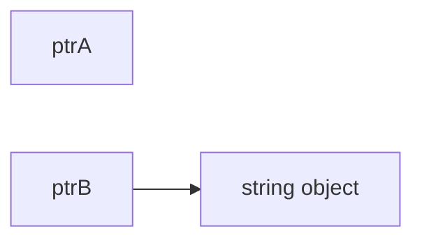

# unique_ptr

unique_ptr 由 C++11 引入,旨在替代不安全的 auto_ptr。

unique_ptr 是一种定义在头文件<memory>中的智能指针。它持有对对象的独有权——两个unique_ptr 不能指向一个对象,即 unique_ptr 不共享它所管理的对象。

它无法复制到其他 unique_ptr,无法通过值传递到函数,也无法用于需要副本的任何标准模板库(STL)算法。只能移动 unique_ptr,即对资源管理权限可以实现转移。

这意味着,内存资源所有权可以转移到另一个 unique_ptr,并且原始 unique_ptr 不再拥有此资源。实际使用中,建议将对象限制为由一个所有者所有,因为多个所有权会使程序逻辑变得复杂。

因此,当需要智能指针用于存 C++ 对象时,可使用 unique_ptr,构造 unique_ptr 时,可使用 make_unique Helper 函数。

auto ptrA = make_unique<string>("dablelv");


auto ptrB = std::move(ptrA);



unique_ptr 与原始指针一样有效,并可用于 STL 容器。将 unique_ptr 实例添加到 STL 容器运行效率很高,因为通过 unique_ptr 的移动构造函数,不再需要进行复制操作。unique_ptr 指针与其所指对象的关系：在智能指针生命周期内,可以改变智能指针所指对象,如创建智能指针时通过构造函数指定、通过 reset 方法重新指定、通过 release 方法释放所有权、通过移动语义转移所有权,unique_ptr 还可能没有对象,这种情况被称为 empty。


**make_unique()**是C++14引入的功能,但是可以广泛使用。
```cpp
template< class T, class... Args >
unique_ptr<T> make_unique( Args&&... args );
```


>构造 T 类型的对象并将其包装进 std::unique_ptr。

构造非数组类型 T 的对象。传递实参 args 给 T 的构造函数。此重载只有在 T 不是数组类型时才会参与重载决议。函数等价于：
```cpp
unique_ptr<T>(new T(std::forward<Args>(args)...))
```
构造拥有给定动态大小的数组。值初始化数组元素。此重载只有在 T 是未知边界数组时才会参与重载决议。函数等价于：
```cpp
unique_ptr<T>(new std::remove_extent_t<T>[size]())
```


# int数据类型

以**int变量**为例

先定义int型的智能指针length,在给智能指针分配空间时赋值12

``` cpp
#include <iostream>
#include <memory>

class Box
{
public:
    double breadth; // 宽度
    double height;  // 高度

    std::unique_ptr<int> length; // 智能指针
};

int main()
{
    Box Box1;
    Box1.length = std::make_unique<int>(12);
    // Box1.length.reset(new int(12));//也是给一个指针申请内存时赋值
    std::cout << "volume of Box1 is " << *(Box1.length) << std::endl;
    return 0;
}
```

也可以先定义时针,再申请内存,再赋值。

``` cpp
//第一种写法
Box1.length = std::make_unique<int>();
*(Box1.length) = 10;
//第二种写法
Box1.length.reset(new int());
*(Box1.length) = 10;
```

运行结果
``` cpp
$ ./demo
volume of Box1 is 12
```

# 数组

``` cpp
#include <iostream>
#include <memory>

class Box
{
public:
    double breadth; // 宽度
    double height;  // 高度

    std::unique_ptr<int[]> length;
};

int main()
{
    Box Box1;
    Box1.length = std::make_unique<int[]>(10);
    //Box1.length.reset(new int[10]);
    Box1.length[5] = 10;
    std::cout << "volume of Box1 is " << Box1.length[5] << std::endl;
    return 0;
}
```

定义指针时,直接初始化

``` cpp
std::unique_ptr<int[]> length{new int[5]{1, 2, 3, 4, 5}};

```

错误写法

``` cpp
unique_ptr<int[10]> ar_up(new int[10]); // 无法编译
unique_ptr<int> ar_up(new int[10]); // 编译没有问题,但是运行时可能会出错 
```

# 类

``` cpp
#include <iostream>
#include <memory>

class Box
{
public:
    double breadth; // 宽度
    double height;  // 高度

    Box();
    class rectangle;
    std::unique_ptr<rectangle> ob_rectangle; //智能指针
};

Box::Box()
{
    std::cout << "Box Constructor" << std::endl;
    this->ob_rectangle = std::make_unique<Box::rectangle>();
}
class Box::rectangle
{
public:
    rectangle()
    {
        std::cout << "rectangle Constructor" << std::endl;
    }
};
int main()
{
    Box Box1;
    return 0;
}

```

 运行结果

``` cpp
[chenjindou@manjaro C++]$ ./demo
Box Constructor
rectangle Constructor
main
```

这个**说明**:使用make_unique给ob_rectangle申请内存时,会实例化rectangle这里,也就会打印rectangle Constructor。

**注意：**下面这个rectangle类的构造函数必须使用public

``` cpp
class Box::rectangle
{
public:
    rectangle()
    {
        std::cout << "rectangle Constructor" << std::endl;
    }
};

```

因为this->ob_rectangle = std::make_unique<<Box::rectangle>>();调用了rectangle类的构造函数。


# 所有权的变化

``` cpp
// 所有权的变化 
unique_ptr<int> u_i2(new int(4));//创建时指定动态对象
int *p_i = u_i2.release();	//释放所有权  
unique_ptr<string> u_s(new string("abc"));  
unique_ptr<string> u_s2 = std::move(u_s); //所有权转移(通过移动语义),u_s所有权转移后,变成“空指针” 
u_s2.reset(u_s.release());	//所有权转移
u_s2=nullptr;//显式销毁所指对象,同时智能指针变为空指针。与u_s2.reset()等价
```