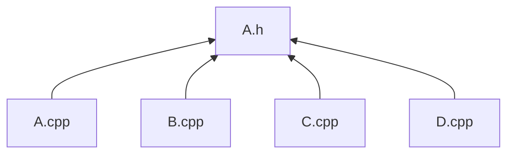

PIMPL(Pointer to Implementation)这个手法可以解決/改善C++编码时常碰到的2大问题。
1.避免重复编译

2.隐藏实现

Pimpl(pointer to implementation, 指向实现的指针)是一种常用的，用来对“类的接口与实现”进行解耦的方法。这个技巧可以避免在头文件中暴露私有细节(见下图1)，因此是促进API接口与实现保持完全分离的重要机制。但是Pimpl并不是严格意义上的设计模式(它是受制于C++特定限制的变通方案)，这种惯用法可以看作桥接设计模式的一种特例。

# 1、避免重新编译

Q1.class增加private/protected成员时，使用此class的相关 .cpp(s) 需要重新编译

pimpl模式也被称为编译防火墙，是一种用来减少编译时间的方法。通常来讲，如果头文件里的某些内容变更了，意味着所有引用该头文件的代码都要被重新编译，即使变更的是无法被用户类访问的私有成员。将这部分代码从被引用多次的头文件里移除到只被引用编译一次的源文件中，更改此文件就不会付出太长的编译时间。

假设我们有一个A.h(class A)，並且有A/B/C/D 4個.cpp引用他，他们的关系如下图：



如果A class增加了private/protected成员，A/B/C/D .cpp全部都要重新编译。因为make是用文件的时间戳记录来判断是否要从新编译，当make发现A.h比A/B/C/D .cpp4个文件新时，就会通知compiler重新编译他们，就算你的C++ compiler非常聪明，知道B/C/D文件只能存取A class public成员，make还是要通知compiler起来检查。三个文件也许还好，那五十个，一百个呢？

解决办法：

```
//a.h
#ifndef A_H
#define A_H
 
#include <memory>
 
class A
{
public:
    A();
    ~A();
     
    void doSomething();
     
private:    
      struct Impl;
      std::auto_ptr<impl> m_impl;
};
 
#endif
```

使用前置声明(forward declaration)可以减少编译依赖，这个技巧告诉compile指向 class/struct的指针，而不用暴露struct/class的实现。在这里我们把原本的private成员封裝到struct A::Impl里，用一个不透明的指针(m_impl)指向他，auto_ptr是个smart pointer(from STL)，会在A class object销毁时连带将资源销毁还给系统。

```
//a.cpp
#include <stdio.h>
#include "a.h"
 
struct A::Impl
{
    int m_count;
    Impl();
    ~Impl();
    void doPrivateThing();
};  
 
A::Impl::Impl():
    m_count(0)
{
}
 
A::Impl::~Impl()
{
}          
 
void A::Impl::doPrivateThing()
{
    printf("count = %d\n", ++m_count);
}    
 
A::A():m_impl(new Impl)
{
}      
 
A::~A()
{
} 
 
void A::doSomething()
{
    m_impl->doPrivateThing();    
}    
```

上面我们可以看到A private数据成员和成员函数全部被封裝到struct A::Impl里，如此一来无论private成员如何改变都只会重新编译A.cpp，而不会影响B/C/D.cpp，当然有时会有例外，不过大部分情况下还是能节约大量编译时间，项目越大越明显。

# 2、隐藏实现

为了实现Pimpl，我们先来看一种普通的类的设计方法。
假如我们要设计一书籍类Book，Book包含目录属性，并提供打印书籍信息的对外接口，Book设计如下：

```
class Book
{
public:
  void print();
 
private:
  std::string  m_Contents;
};
```

Book的使用者只需要知道print()接口，便可以使用Book类，看起来一切都很美好。
然而，当某一天，发现Book需要增加一标题属性，对Book类的修改如下：

```
class Book
{
public:
  void print();
 
private:
  std::string  m_Contents;
  std::string  m_Title;
};
```

虽然使用print()接口仍然可以直接输出书籍的信息，但是Book类的使用者却不得不重新编译所有包含Book类头文件的代码。
为了隐藏Book类的实现细节，实现接口与实现的真正分离，可以使用Pimpl方法。
我们依然对Book类提供相同的接口，但Book类中不再包含原有的数据成员，其所有操作都由BookImpl类实现。

```
/* public.h */
#ifndef PUBLIC_H_INCLUDED
#define PUBLIC_H_INCLUDED
 
class Book
{
public:
  Book();
  ~Book();
  void print();
 
private:
  class BookImpl;  // Book实现类的前置声明
  BookImpl* pimpl;
};
 
#endif
```

在对外的头文件public.h中，只包含Book类的外部接口，将真正的实现细节被封装到BookImpl类。为了不对外暴露BookImpl类，将其声明为Book类的内嵌类，并声明为private。

BookImpl类的头文件如下。

```
/* private.h */
#ifndef PRIVATE_H_INCLUDED
#define PRIVATE_H_INCLUDED
 
#include "public.h"
#include <iostream>
 
class Book::BookImpl
{
public:
  void print();
 
private:
  std::string  m_Contents;
  std::string  m_Title;
};
 
#endif
```

private.h并不需要提供给Book类的使用者，因此，如果往后需要重新设计书籍类的属性，外界对此一无所知，从而保持接口的不变性，并减少了文件之间的编译依赖关系。

```
/* book.cpp */
#include "private.h"  // 我们需要调用BookImpl类的成员函数，
                      // 所以要包含BookImpl的定义头文件
#include "public.h"  // 我们正在实现Book类，所以要包含Book类
                     // 的头文件
 
Book::Book()
{
  pimpl = new BookImpl();
}
 
Book::~Book()
{
  delete pimpl;
}
 
void Book::print()
{
  pimpl->print();
}
 
/* BookImpl类的实现函数 */
 
void Book::BookImpl::print()
{
  std::cout << "print from BookImpl" << std::endl;
}
```

使用Book类的接口的方法如下

```
/* main.cpp */
#include "public.h"
 
int main()
{
    Book book;
    book.print();
 
    return 0;
}

```

像Book类这样使用Pimpl的类，往往被称为handle class，BookImpl类作为实现类，被称为implementation class。

为简单实现起见，Book类省略了复制构造函数和复制赋值函数。在实际应用中，一般有两种可选方案解决Book的复制和赋值的语义问题。

(1) 禁止复制类
如果不打算让用户创建对象的副本，那么可以将对象声明为不可复制的。可以将复制构造函数和复制赋值函数声明为私有的，这样在复制或者赋值时就会产生编译错误。
以下代码通过声明私有的复制构造函数和复制赋值函数来使得对象不可以复制，不需要修改相关的.cpp文件

```
/* public.h */
#ifndef PUBLIC_H_INCLUDED
#define PUBLIC_H_INCLUDED
 
class Book
{
public:
  Book();
  ~Book();
  void print();
 
private:
  // 禁止复制类
  Book(const Book&);
  const Book &operator = (const Book &);
 
  class BookImpl;  // Book实现类的前置声明
  BookImpl* pimpl;
};
 
#endif

```

(2) 显示定义复制语义
如果希望用户能够复制采用Pimpl的对象，就应该声明并定义自己的复制构造函数和复制赋值函数。它们可以执行对象的深复制，即创建对象的副本，而非复制指针。

Pimpl惯用法最主要的缺点是，必须为你创建的每个对象分配并释放实现对象，这使对象增加了一个指针，handle class成员函数的每次调用都必须通过implementation class，这会增加一层间接性。在实际中你需要对这些开销进行权衡。
另外，采用了Pimpl的对象，编译器将不再能够捕获const方法中对成员变量的修改。这是由于成员变量现在存在于独立的对象中，编译器仅检查const方法中的pimpl指针是否发生变化，而不会检查pimpl指向的任何成员。

