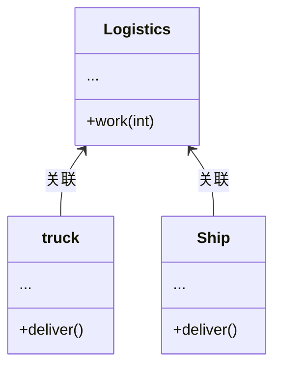
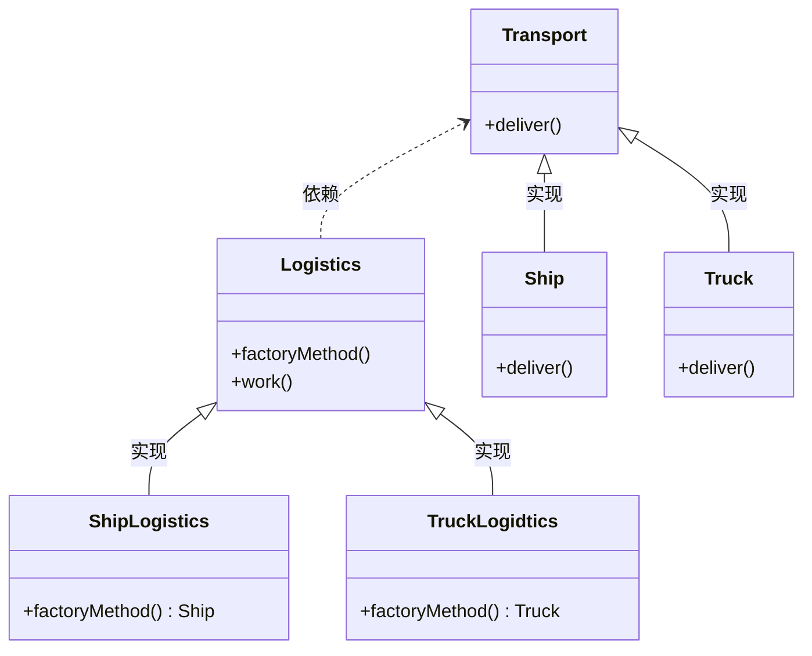
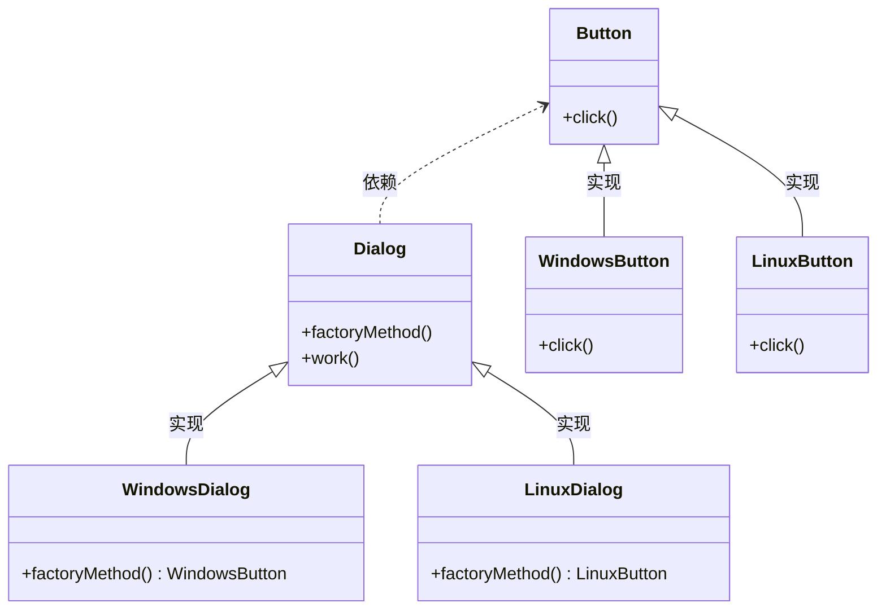

# 问题的引入

分类：(类)创建型

场景：一个物流公司最初只使用卡车运输，现需要增加轮船运输业务。目前的程序代码和卡车关联。

解决：定义一个用于创建对象的接口，让子类决定实例化哪一个类。Factory Method 使得一个类的实例化延迟到其子类。

思考：在创建型的设计模式中，工厂方法模式（Factory Method）是唯一用类解决问题的。

# 物流公司问题
初始代码
```cpp
#include <iostream>
using namespace std;
class Truck
{
public:
    void deliver()
    {
        cout << "卡车运输货物" << endl;
    }
};
class Logistics
{
public:
    void work()
    {
        Truck *truck = new Truck();
        truck->deliver();
        delete truck;
    }
};
int main()
{
    Logistics *logistics = new Logistics();
    logistics->work();
    delete logistics;
    return 0;
}
```
代码执行结果
``` cpp
$ ./demo 
卡车运输货物
```
这个时候我需要加一个轮船运输业务，但是目前程序代码和卡车关联，如果要增加轮船运输业务，需要修改代码，增加轮船类，修改Logistics类，增加轮船运输业务。
代码如下
```cpp
#include <iostream>
using namespace std;
class Truck
{
public:
    void deliver()
    {
        cout << "卡车运输货物" << endl;
    }
};
class Ship
{
public:
    void deliver()
    {
        cout << "轮船运输货物" << endl;
    }
};
class Logistics
{
public:
    void work(int flg)
    {
        if (flg == 0)
        {
            Truck *truck = new Truck();
            truck->deliver();
            delete truck;
        }
        if (flg == 1)
        {
            Ship *ship = new Ship();
            ship->deliver();
            delete ship;
        }
    }
};
int main()
{
    Logistics *logistics = new Logistics();
    logistics->work(0);
    logistics->work(1);
    delete logistics;
    return 0;
}
```
运行结果
``` cpp
$ ./demo 
卡车运输货物
轮船运输货物
```
这样确实实现了需求，但是代码不够优雅，如果要增加新的运输业务，需要修改Logistics类，增加新的运输业务。这样会使得Logistics的work方法变得非常长，并且代码不够清晰。

上述代码类的关系如下：


**使用工厂方法模式**

代码如下
```cpp
#include <iostream>
using namespace std;

class Transport
{
public:
    virtual ~Transport() {}
    virtual void deliver() const = 0;
};

class Logistics
{
public:
    virtual ~Logistics() {}
    virtual Transport *factoryMethod() const = 0;
    void work()
    {
        Transport *tansport = factoryMethod();
        tansport->deliver();
        delete tansport;
    }
};
class Truck : public Transport
{
public:
    void deliver() const override
    {
        cout << "卡车运输货物" << endl;
    }
};

class TruckLogidtics : public Logistics
{
public:
    virtual ~TruckLogidtics() {}
    Transport *factoryMethod() const override
    {
        return new Truck();
    }
};

class Ship : public Transport
{
public:
    void deliver() const override
    {
        cout << "轮船运输货物" << endl;
    }
};

class ShipLogistics : public Logistics
{
public:
    virtual ~ShipLogistics() {}
    Transport *factoryMethod() const override
    {
        return new Ship();
    }
};

int main()
{
    Logistics *trcklogistics = new TruckLogidtics();
    trcklogistics->work();
    delete trcklogistics;
    Logistics *shiplogistics = new ShipLogistics();
    shiplogistics->work();
    delete shiplogistics;
    return 0;
}
```
运行结果
``` cpp
$ ./demo 
卡车运输货物
轮船运输货物
```
工厂方法的好处就是物流公司的业务变化，不需要修改Logistics类，只需要增加新的物流业务类，实现工厂方法即可。

这里为了不改变Logistics类，所以将工厂方法放到Logistics类中，不改变让Logistics类的业务逻辑，让子类new一个对象。

这就是工厂方法模式，把一个类的实例化延迟到其子类。

**为什么叫工厂方法**：上面举例是物流公司，对于一个工厂也是一样的逻辑，之前工厂只生产产品A，并在在工厂生产的方法里有生产/打包/发货等过程。现在需要新生产产品B，但是尽量不动个工厂生产的方法里有生产/打包/发货等过程这些代码。这个时候用工厂模式最合适不过了。

代码类图如下


**缺点**：应用工厂方法模式需要引入新的子类，代码可能会因此变的更复杂，最好的情况是将该模式引入创建类的现有层次结构中。

# 跨平台UI问题

跨平台的对话框:在不同的操作系统下，UI组件外观和交互方式会有所不同，但是其功能保持一致。使用工厂方法模式，就不需要为每种操作系统重写对话框逻辑。

类图如下
