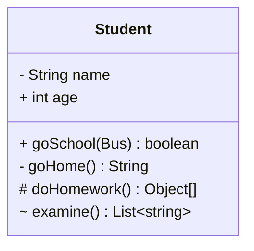
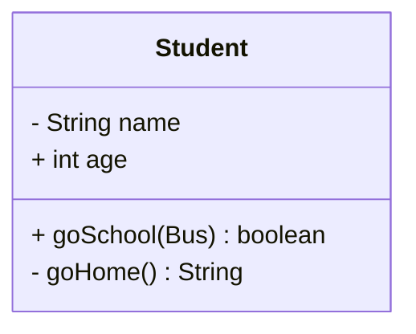
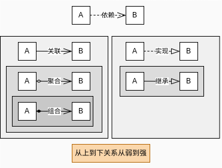
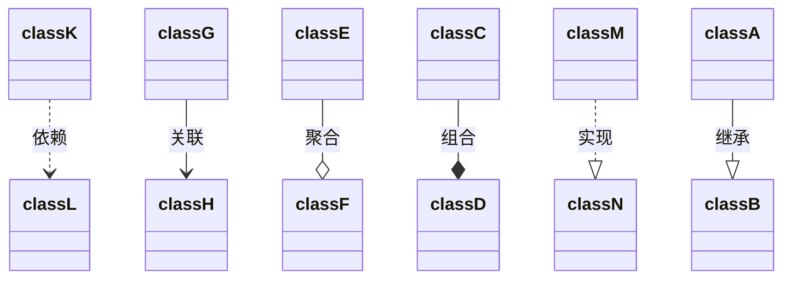
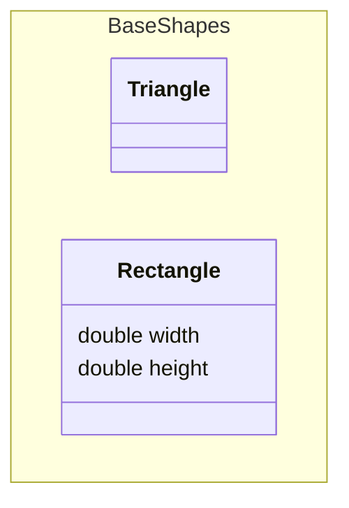
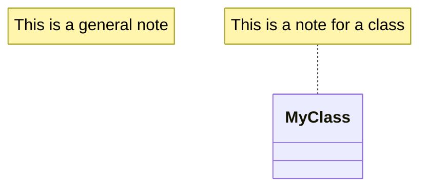
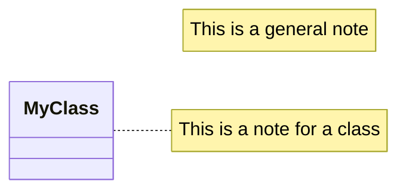
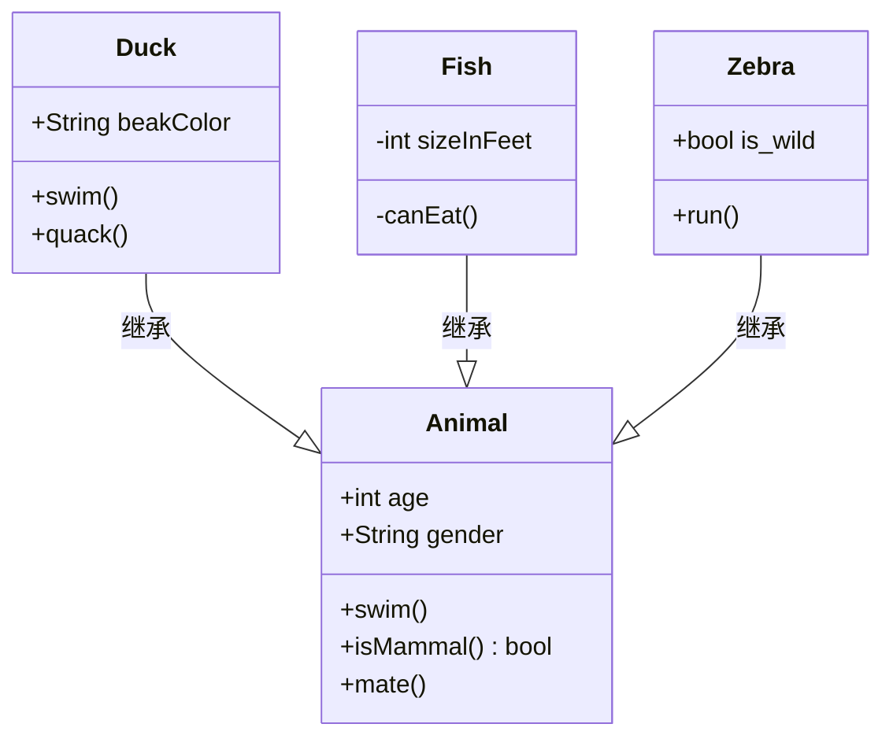

# 什么是设计模式
设计模式是软件设计中常见问题的**典型解决方案**，可用于解决软件中**反复出现的设计问题**。
> 设计模式不是算法，算法是解决特定问题的一种方法，设计模式是解决特定问题的一种设计思想。

# 设计模式背后的面向对象设计原则
- 封装变化 (封装：将抽象与实现分离)
- 多用组合，少用继承 （继承）
- 针对接口编程，不要针对实现编程（多态）
- 为交互对对象之间的松耦合而设计
- 对扩展开放，对修改关闭
- ....

# 设计模式分类(针对模式的意图分类)
- 创建型模式：创建对象的机制，从所需要实例化的对象中解耦。
- 结构型模式：将对象或类组装到更大的机构中。
- 行为型模式：负责对象之间的交互和分配职责。
**分类的目的是为了更抽象的了解设计模式，以及属性他们之间的关系**


# 设计模式书籍
《Head First 设计模式》

# UML 类图

统一建模语言(Unified Modeling Language，UML)是一种为面向对象系统的产品进行说明、可视化和编制文档的一种标准语言，是非专利的第三代建模和规约语言

 mermaid是一种JavaScript库, 可以用于生成流程图、序列图、甘特图等各种图表。由于其简单易用、功能强大,越来越多的人开始使用它来创建图表。

 在vscode中使用 Markdown Preview Mermaid Support 插件在markdown中直接写代码生成图表

 
| 关键字 | 定义 | 
| --- | --- | 
| classDiagram	| 定义类图| 
| class{}	| 定义一个类，属性和方法写在{}内，如无内容，则不写{}| 
| +	| 权限：公共| 
| -	| 权限：私有| 
| #	| 权限：保护| 
| ~	| 权限：包 / 内部| 
| $	| 静态| 
 
示例如下
类属性与方法
- 类：格式：class 类名{} ，如果类内容为空，则省略{}。比如class Object、class Person{}
- 属性： 格式：权限 类型 属性名，比如- String name
- 方法：格式：权限 方法名(参数类型) 返回值类型 ，比如+ goSchool(Bus) boolean

 示例如下

也可以如下简洁写法，这个简洁的写法在一些编辑器上面无法显示注释，比如typora就不显示


**类的注解**

类的注解作为特殊标记包括：
-  &lt;&lt;interface &gt;&gt; 接口
- &lt;&lt;abstract&gt;&gt;  抽象类
- &lt;&lt;service&gt;&gt; 服务等级
- &lt;&lt;enumeration&gt;&gt; 枚举

这种特殊标记可以有两种表现形式
1. 在类名后直接写
    ```mermaid
    classDiagram
    class ICourse{
        + String name	
        + select() Boolean 
    }
    <<interface>> ICourse
    ```
2. 与类一起定义在嵌套结构中
    ```mermaid
    classDiagram
    class Gender{
        <<enumeration>>
        MALE
        FEMALE
    }
    ```

类的关系图

他们之间的关系



- 依赖关系：表示一个对象依赖于另一个对象，A 依赖于 B,B 的改变必将影响到 A。
- 关联关系：对象A关联对象B。
- 聚合关系：对象A由对对象B组成，对象B的生命周期不是A的生命周期。
- 组合关系：对象A由对象B组成，对象B的生命周期是A的生命周期。
    >关联说明A和B有关系，更进一步是聚合关系，也就是A拥有B，但是B可以独立存在。再进一步是组合关系，也就是A和B是紧密的，A和B的生命周期是A的生命周期。关于生命周期理解：鸡腿和鸡的关系就是组合关系，鸡死了，鸡腿也死了，鸡腿的生命周期是受鸡的影响的。
- 实现关系：类A定义的方法由接口B声明。
- 继承关系：类A继承类B的接口和实现，但是可以对其进行扩展。

> 除学术要求，一般不会有这么详细的关系。依赖和关联不用分的那么清楚，只需要指导A和B是有关系的，A依赖B。聚合和组合，只需要指导是has a的关系，也就是A包含B。实现和继承，只需要知道是is a的关系，也就是A是B。


**使用UML符号来表示关系**


支持分类


添加note

设置图表方向

综合示例
