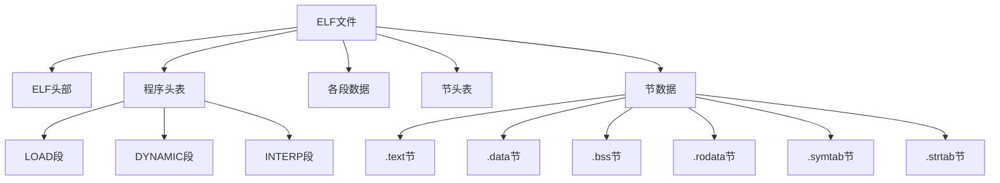
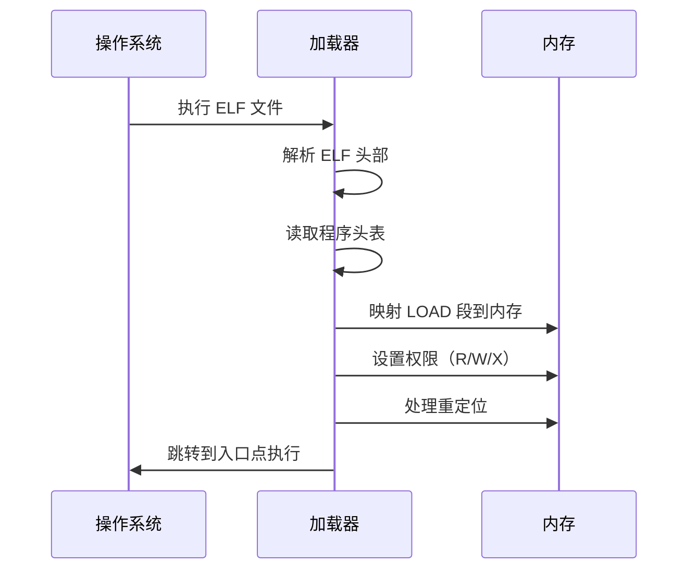

# linu下可执行文件分析

## gcc和g++的区别

gcc主要用于编译C语言，g++用来编译C++。由于C++是兼容C语言的，所以g++也可以用来编译C语言。

实践建议

* 纯 C 代码：用 gcc 编译（更轻量，无多余 C++ 库依赖）
* 哪怕是兼容 C 的 C++ 代码：若用 C++ 编译器（g++），会引入少量 C++ 运行时开销，无功能影响但文件略大

关于编译出来的可执行文件。

1. 文件格式（ELF 结构）：g++ 和 gcc 编译生成的可执行文件都是标准 ELF 格式，包含 ELF 头、.text/.data 等段，格式层面完全一致。
2. 二进制内容：因编译参数、链接库、符号表的差异，二进制文件本身不同。

## 源码准备

简单的C代码

``` C
$ cat main.c
#include <stdio.h>

/* 初始化的全局变量 - 在.data段 */
int global_init_var = 10;

/* 未初始化的全局变量 - 在.bss段 */
int global_uninit_var;

/* 初始化的静态全局变量 - 在.data段 */
static int static_global_init_var = 20;

/* 未初始化的静态全局变量 - 在.bss段 */
static int static_global_uninit_var;

/* 常量全局变量 - 在.rodata段 */
const int const_global_var = 100;

/* 字符串常量 - 在.rodata段 */
const char *str_const = "Hello, ELF!";

/* 函数声明 */
int add(int a, int b);
void recursive_function(int n);
static void static_function(void);

int main() {
    /* 局部变量 - 在栈上 */
    int local_var = 5;
    
    /* 局部静态变量 - 在.data段 */
    static int static_local_var = 30;
    
    /* 数组 - 局部数组在栈上 */
    int local_array[5] = {1, 2, 3, 4, 5};
    
    /* 指针 */
    int *ptr = &local_var;
    
    /* 调用函数 */
    int sum = add(10, 20);
    printf("Sum: %d\n", sum);
    printf("Global init: %d\n", global_init_var);
    printf("Const string: %s\n", str_const);
    
    /* 调用静态函数 */
    static_function();
    
    /* 递归调用展示栈帧 */
    recursive_function(3);
    
    /* 使用未初始化全局变量 */
    printf("Global uninit: %d\n", global_uninit_var);
    
    return 0;
}

/* 普通函数 - 在.text段 */
int add(int a, int b) {
    /* 函数内静态变量 - 在.data段 */
    static int call_count = 0;
    call_count++;
    printf("add() called %d times\n", call_count);
    return a + b;
}

/* 静态函数 - 在.text段但有局部符号特性 */
static void static_function(void) {
    printf("This is a static function\n");
}

/* 递归函数 - 用于展示栈帧 */
void recursive_function(int n) {
    int local_recursive = n * 10;
    if (n > 0) {
        printf("Recursive call %d, local value: %d\n", n, local_recursive);
        recursive_function(n - 1);
    }
}
```

编译成可执行文件

``` bash
# 无调试信息（默认）
gcc main.c -o main_no_debug
# 有调试信息（-g3 最完整）
gcc -g3 main.c -o main_with_debug
$
```

有无调试信息的区别

``` bash
# 列出所有节（对比节的数量和名称）
readelf -S main_no_debug
readelf -S main_with_debug
```

* main_no_debug的节列表：只有.text、.data、.bss、.rodata、.symtab、.strtab 等核心节
* main_with_debug的节列表：除核心节外，会多出.debug_info、.debug_line、.debug_abbrev等十余个调试节

## ELF文件结构

ELF（Executable and Linkable Format）是Unix/Linux系统中最常见的可执行文件、目标文件、共享库和核心转储的标准文件格式。

```text
ELF 文件布局：
+-------------------------------+
|          ELF 头部             |  <- 描述文件整体信息
+-------------------------------+
|        程序头表（可选）        |  <- 描述段信息（运行时视图）
+-------------------------------+
|            .text              |  <- 代码段
+-------------------------------+
|            .data              |  <- 已初始化数据段
+-------------------------------+
|            .bss               |  <- 未初始化数据段（不占文件空间）
+-------------------------------+
|          其他节...            |
+-------------------------------+
|        节头表（可选）          |  <- 描述节信息（链接视图）
+-------------------------------+
|        .shstrtab              |  <- 节名字符串表
+-------------------------------+
```

mermaid版本



ELF 加载过程图



查看文件类型

``` bash
+$ file main_with_debug
main_with_debug: ELF 64-bit LSB pie executable, x86-64, version 1 (SYSV), dynamically linked, interpreter /lib64/ld-linux-x86-64.so.2, BuildID[sha1]=adfa07b3941c328ac49168e95199ea626d52d4c9, for GNU/Linux 3.2.0, with debug_info, not stripped
```

字段解读

| 字段 | 含义解析 |
|------|----------|
| `main_with_debug:` | 待分析的文件名 |
| `ELF 64-bit` | 核心格式：<br>- ELF（Executable and Linkable Format）：Linux/Unix 系统的标准二进制格式（区别于Windows的PE格式）；<br>- 64-bit：适配64位CPU架构（x86-64/AMD64）。 |
| `LSB` | 字节序：<br>LSB（Little Endian，小端序）：低字节数据存储在内存低地址，是x86架构的默认字节序（对应MSB大端序，常见于ARM/MIPS等架构）。 |
| `pie executable` | 可执行类型：<br>- PIE（Position-Independent Executable）：位置无关可执行文件，现代Linux的安全特性（加载时随机分配内存基址，防止缓冲区溢出等攻击）；<br>- executable：明确这是可执行文件（区别于目标文件.o、共享库.so、核心转储core等）。 |
| `x86-64` | 目标CPU架构：即AMD64/Intel 64位x86架构（日常说的「64位Intel/AMD处理器」）。 |
| `version 1 (SYSV)` | ELF格式版本：遵循System V ABI（应用程序二进制接口）标准的第1版，是Linux的通用兼容标准。 |
| `dynamically linked` | 链接方式：<br>动态链接（运行时依赖系统共享库，如libc.so.6），而非静态链接（statically linked，会把所有依赖库打包进文件，体积大但不依赖系统库）。 |
| `interpreter /lib64/ld-linux-x86-64.so.2` | 动态链接器（解释器）：<br>运行该程序时，由这个内核级程序先加载所需的共享库（如libc），再启动主程序，是64位x86 Linux系统的默认动态链接器。 |
| `BuildID[sha1]=xxxx` | 构建唯一标识：<br>SHA1哈希值用于标记二进制文件的构建版本，方便调试（匹配符号表、内核模块、共享库版本）、部署（校验文件完整性）。 |
| `for GNU/Linux 3.2.0` | 最低内核版本：<br>该程序可运行在GNU/Linux内核3.2.0及以上版本（主流Linux发行版（Ubuntu/CentOS）的内核均远高于此，无需担心兼容性）。 |
| `with debug_info` | 调试信息：<br>文件包含调试信息（如DWARF格式），说明编译时大概率加了 `-g` 参数（gcc/clang的调试选项），可直接用gdb调试（查看源码、变量、函数调用栈）。 |
| `not stripped` | 符号表状态：<br>未剥离（stripped）符号表/调试信息：<br>- 符号表包含函数名、变量名、行号等调试信息；<br>- `not stripped` 说明保留了这些信息（开发/调试阶段常用），若执行 `strip main_with_debug` 会删除符号表，文件体积减小但无法调试。 |

elf定义的头文件

``` bash
$ find /usr/include -name "elf.h"
/usr/include/x86_64-linux-gnu/sys/elf.h
/usr/include/elf.h
/usr/include/linux/elf.h
```

> 使用amd64位平台查看的

elf.h 是「标准通用版」，linux/elf.h 是「内核定制版」，x86_64-linux-gnu/sys/elf.h 是「x86_64 架构优化版」

> 实际上 `x86_64-linux-gnu/sys/elf.h` 也是包含 `elf.h`的，是在x86_64位平台上的扩展。比如在arm linux平台也会基于`elf.h`生成自己平台的头文件，交叉编译，跨平台编译根源。

打开 x86_64-linux-gnu/sys/elf.h

``` bash
$ cat /usr/include/x86_64-linux-gnu/sys/elf.h
/* Copyright (C) 1998-2024 Free Software Foundation, Inc.
   This file is part of the GNU C Library.

   The GNU C Library is free software; you can redistribute it and/or
   modify it under the terms of the GNU Lesser General Public
   License as published by the Free Software Foundation; either
   version 2.1 of the License, or (at your option) any later version.

   The GNU C Library is distributed in the hope that it will be useful,
   but WITHOUT ANY WARRANTY; without even the implied warranty of
   MERCHANTABILITY or FITNESS FOR A PARTICULAR PURPOSE.  See the GNU
   Lesser General Public License for more details.

   You should have received a copy of the GNU Lesser General Public
   License along with the GNU C Library; if not, see
   <https://www.gnu.org/licenses/>.  */

#ifndef _SYS_ELF_H
#define _SYS_ELF_H      1

#ifdef __x86_64__
# error This header is unsupported on x86-64.
#else
# warning "This header is obsolete; use <sys/procfs.h> instead."

# include <sys/procfs.h>
#endif

#endif  /* _SYS_ELF_H */
```

发现 需要用 sys/procfs.h 代替

这个头文件是历史遗留产物，背后有两个关键背景：  

(1) 架构专属的头文件路径  
在 Linux 系统中，/usr/include/x86_64-linux-gnu/ 是 x86_64 架构的专属头文件目录—— 这个目录下的头文件本就是为 x86_64 架构准备的，但 sys/elf.h 是个例外：

* 早期 glibc 中，sys/elf.h 曾用于兼容老旧的 ELF 相关接口，但 x86_64 架构下这些接口已被整合到 <sys/procfs.h> 中；
* 为了避免开发者误用旧头文件，维护者直接在 x86_64 版本的 sys/elf.h 中加了 #error，强制禁止使用。

(2) __x86_64__ 宏的作用  
__x86_64__ 是 GCC/Clang 等编译器在 x86_64 架构下自动定义的内置宏（无需手动定义），用来标识当前编译环境是 64 位 x86 架构：

* 当你在 x86_64 系统上包含这个头文件时，编译器会先定义 __x86_64__，触发 #error "This header is unsupported on x86-64."；
* 如果是 32 位 x86 架构（i386/i686），__x86_64__ 未定义，会走 #warning 分支，提示改用 <sys/procfs.h>。

不再分析 __Linux深层次__ 的东西了，直接分析 /usr/include/elf.h

64位elf文件头格式

``` cpp
typedef struct
{
  unsigned char	e_ident[EI_NIDENT];	/* Magic number and other info */
  Elf64_Half	e_type;			/* Object file type */
  Elf64_Half	e_machine;		/* Architecture */
  Elf64_Word	e_version;		/* Object file version */
  Elf64_Addr	e_entry;		/* Entry point virtual address */
  Elf64_Off	e_phoff;		/* Program header table file offset */
  Elf64_Off	e_shoff;		/* Section header table file offset */
  Elf64_Word	e_flags;		/* Processor-specific flags */
  Elf64_Half	e_ehsize;		/* ELF header size in bytes */
  Elf64_Half	e_phentsize;		/* Program header table entry size */
  Elf64_Half	e_phnum;		/* Program header table entry count */
  Elf64_Half	e_shentsize;		/* Section header table entry size */
  Elf64_Half	e_shnum;		/* Section header table entry count */
  Elf64_Half	e_shstrndx;		/* Section header string table index */
} Elf64_Ehdr;
```

使用命令查看

``` bash
$ readelf -h main_with_debug
ELF 头：
  Magic：   7f 45 4c 46 02 01 01 00 00 00 00 00 00 00 00 00
  类别:                              ELF64
  数据:                              2 补码，小端序 (little endian)
  Version:                           1 (current)
  OS/ABI:                            UNIX - System V
  ABI 版本:                          0
  类型:                              DYN (Position-Independent Executable file)
  系统架构:                          Advanced Micro Devices X86-64
  版本:                              0x1
  入口点地址：               0x10a0
  程序头起点：          64 (bytes into file)
  Start of section headers:          43264 (bytes into file)
  标志：             0x0
  Size of this header:               64 (bytes)
  Size of program headers:           56 (bytes)
  Number of program headers:         13
  Size of section headers:           64 (bytes)
  Number of section headers:         38
  Section header string table index: 37
```

文件头解读

| 字段 | 输出值 | 含义解读 |
|------|--------|----------|
| Magic（魔数） | 7f 45 4c 46 02 01 01 00 ... | ELF 文件的“身份标识”：<br>- `7f 45 4c 46` 对应 ASCII 的 `^? E L F`，是 ELF 文件的特征魔数；<br>- 第5字节 `02` = ELF64（`01` 是 ELF32）；<br>- 第6字节 `01` = 小端序（x86/x86-64 架构默认）；<br>- 第7字节 `01` = ELF 版本 1（当前通用版本）；<br>- 后续 `00` 为默认填充（无特殊 OS/ABI 扩展）。 |
| 类别 | ELF64 | 该文件是 **64位 ELF 文件**（对应 x86-64 架构，区别于 32 位的 ELF32）。 |
| 数据 | 2 补码，小端序 | 数据存储规则：<br>- 整数采用“2补码”表示（计算机通用方式）；<br>- 字节序为“小端序”（低字节存低地址，x86/x86-64 架构的核心特征）。 |
| Version | 1 (current) | ELF 标准版本为 1，是当前 Linux/Unix 系统通用的版本。 |
| OS/ABI | UNIX - System V | 目标操作系统/ABI 是 System V（Linux 基于 System V ABI，这是 Linux 可执行文件的默认值）。 |
| ABI 版本 | 0 | ABI 扩展版本为 0，无特殊自定义扩展。 |
| 类型 | DYN (Position-Independent Executable file) | ELF 类型为 `DYN`（动态链接文件），但备注为 **PIE（位置无关可执行文件）**：<br>- 正常 `DYN` 是共享库（.so），但 Linux 中 PIE 可执行文件会标记为 `DYN`（而非 `ET_EXEC` 普通可执行文件）；<br>- PIE 支持地址随机化（ASLR），提升程序安全性（现代 Linux 编译默认开启）。 |
| 系统架构 | Advanced Micro Devices X86-64 | 目标 CPU 架构是 **x86-64（AMD64/Intel 64）**，即 64 位 x86 架构。 |
| 版本 | 0x1 | 与 `Version` 一致，ELF 文件版本为 1。 |
| 入口点地址 | 0x10a0 | 程序执行时 CPU 跳转的**起始虚拟地址**：<br>- PIE 文件的入口地址是“相对地址”，加载时会被 ASLR 重定位（实际运行地址不固定）；<br>- 非 PIE 文件的入口地址是绝对地址。 |
| 程序头起点 | 64 (bytes into file) | **程序头表（Program Header Table）** 在文件中的偏移量为 64 字节；<br>程序头表描述“如何将文件加载到内存”（比如段的位置、权限、大小），是加载器（loader）的核心参考。 |
| Start of section headers | 43264 (bytes into file) | **节头表（Section Header Table）** 在文件中的偏移量为 43264 字节；<br>节头表描述文件的“逻辑分区”（比如 .text 代码节、.data 数据节、.debug 调试节），是链接器/调试器的核心参考。 |
| 标志 | 0x0 | ELF 架构标志位：x86-64 架构无特殊标志（比如 ARM 架构会有字节序/ISA 标志）。 |
| Size of this header | 64 (bytes) | ELF 头部本身的大小为 64 字节（ELF64 头部固定 64 字节，ELF32 是 52 字节）。 |
| Size of program headers | 56 (bytes) | 程序头表中**单个表项**的大小为 56 字节（ELF64 程序头项固定 56 字节，ELF32 是 32 字节）。 |
| Number of program headers | 13 | 程序头表共有 13 个表项，每个表项对应一个“加载段”或辅助信息（比如动态链接段、栈段、动态符号表段等）。 |
| Size of section headers | 64 (bytes) | 节头表中**单个表项**的大小为 64 字节（ELF64 节头项固定 64 字节，ELF32 是 40 字节）。 |
| Number of section headers | 38 | 节头表共有 38 个表项；<br>因文件名为 `main_with_debug`（包含调试信息），节数量远多于无调试的可执行文件（无调试通常 20 左右），多出来的是 .debug_info、.debug_line、.debug_frame 等调试节。 |
| Section header string table index | 37 | 节头字符串表（.shstrtab）的索引为 37；<br>节头字符串表存储所有节的名称（比如 .text、.debug_info），加载器/调试器通过该索引找到节名。 |

核心特征总结

1. __文件类型__：Linux 下 x86-64 架构的 64 位 PIE 可执行文件（支持 ASLR 地址随机化）；
2. __调试信息__：包含完整调试信息（节头数量 38，远多于普通可执行文件）；

查看程序头

``` bash
$ readelf -l main_with_debug

Elf 文件类型为 DYN (Position-Independent Executable file)
Entry point 0x10a0
There are 13 program headers, starting at offset 64

程序头：
  Type           Offset             VirtAddr           PhysAddr
                 FileSiz            MemSiz              Flags  Align
  PHDR           0x0000000000000040 0x0000000000000040 0x0000000000000040
                 0x00000000000002d8 0x00000000000002d8  R      0x8
  INTERP         0x0000000000000318 0x0000000000000318 0x0000000000000318
                 0x000000000000001c 0x000000000000001c  R      0x1
      [Requesting program interpreter: /lib64/ld-linux-x86-64.so.2]
  LOAD           0x0000000000000000 0x0000000000000000 0x0000000000000000
                 0x00000000000006d8 0x00000000000006d8  R      0x1000
  LOAD           0x0000000000001000 0x0000000000001000 0x0000000000001000
                 0x0000000000000341 0x0000000000000341  R E    0x1000
  LOAD           0x0000000000002000 0x0000000000002000 0x0000000000002000
                 0x0000000000000204 0x0000000000000204  R      0x1000
  LOAD           0x0000000000002da8 0x0000000000003da8 0x0000000000003da8
                 0x0000000000000280 0x0000000000000290  RW     0x1000
  DYNAMIC        0x0000000000002db8 0x0000000000003db8 0x0000000000003db8
                 0x00000000000001f0 0x00000000000001f0  RW     0x8
  NOTE           0x0000000000000338 0x0000000000000338 0x0000000000000338
                 0x0000000000000030 0x0000000000000030  R      0x8
  NOTE           0x0000000000000368 0x0000000000000368 0x0000000000000368
                 0x0000000000000044 0x0000000000000044  R      0x4
  GNU_PROPERTY   0x0000000000000338 0x0000000000000338 0x0000000000000338
                 0x0000000000000030 0x0000000000000030  R      0x8
  GNU_EH_FRAME   0x00000000000020ac 0x00000000000020ac 0x00000000000020ac
                 0x000000000000004c 0x000000000000004c  R      0x4
  GNU_STACK      0x0000000000000000 0x0000000000000000 0x0000000000000000
                 0x0000000000000000 0x0000000000000000  RW     0x10
  GNU_RELRO      0x0000000000002da8 0x0000000000003da8 0x0000000000003da8
                 0x0000000000000258 0x0000000000000258  R      0x1

 Section to Segment mapping:
  段节...
   00
   01     .interp
   02     .interp .note.gnu.property .note.gnu.build-id .note.ABI-tag .gnu.hash .dynsym .dynstr .gnu.version .gnu.version_r .rela.dyn .rela.plt
   03     .init .plt .plt.got .plt.sec .text .fini
   04     .rodata .eh_frame_hdr .eh_frame
   05     .init_array .fini_array .dynamic .got .data .bss
   06     .dynamic
   07     .note.gnu.property
   08     .note.gnu.build-id .note.ABI-tag
   09     .note.gnu.property
   10     .eh_frame_hdr
   11
   12     .init_array .fini_array .dynamic .got
```

解读

| 字段       | 含义                                                                 |
|------------|----------------------------------------------------------------------|
| Type       | 段类型（如 `LOAD` 是可加载段，`INTERP` 是解释器段，`GNU_STACK` 是栈属性段） |
| Offset     | 该段在 ELF 文件中的**磁盘偏移**（文件中的起始位置）|
| VirtAddr   | 该段加载到内存后的**虚拟地址**（进程地址空间中的位置，PIE 会被 ASLR 偏移） |
| PhysAddr   | 物理地址（Linux 虚拟内存中无意义，与 VirtAddr 一致）|
| FileSiz    | 该段在 ELF 文件中的**磁盘大小**（0 表示无文件内容，如栈/堆）|
| MemSiz     | 该段加载到内存后的**内存大小**（可能 > FileSiz，如 .bss 段无文件内容但占内存） |
| Flags      | 内存权限：R=读，W=写，E=执行（最小权限原则）|
| Align      | 内存对齐要求（通常 0x1000=4KB，对应 Linux 页大小）|

其他命令

``` bash
# 查看节头（节信息）
readelf -S main_with_debug

# 查看符号表
readelf -s main_with_debug

# 查看重定位信息
readelf -r main_with_debug

# 查看动态段信息
readelf -d main_with_debug
```
